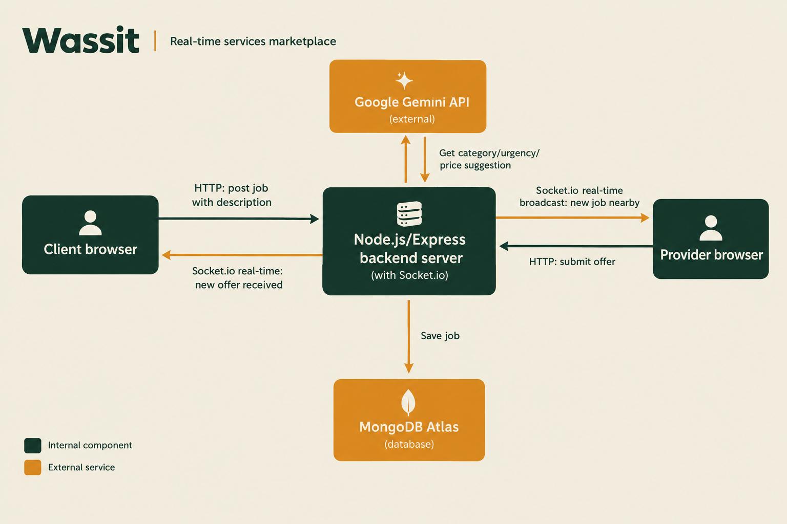
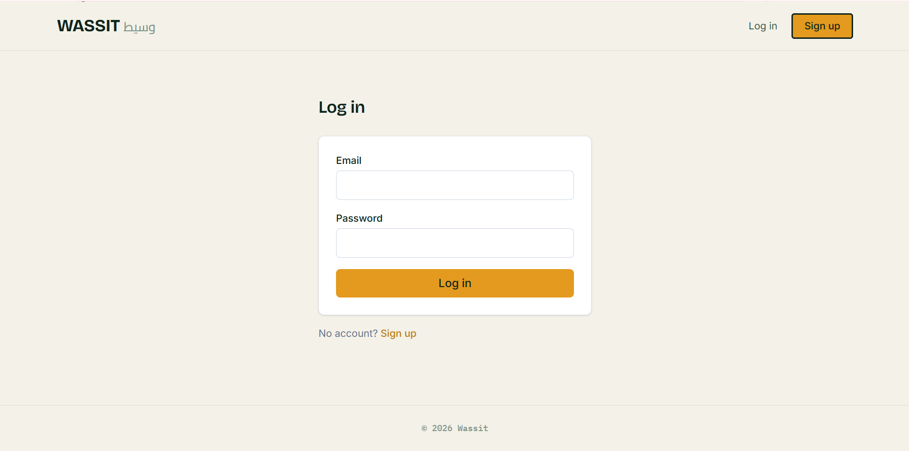
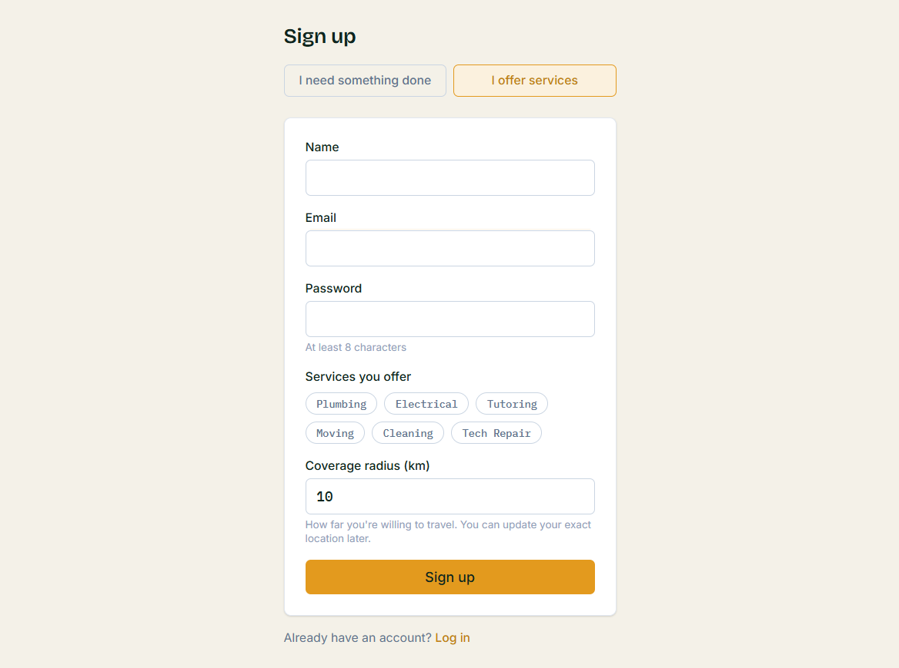
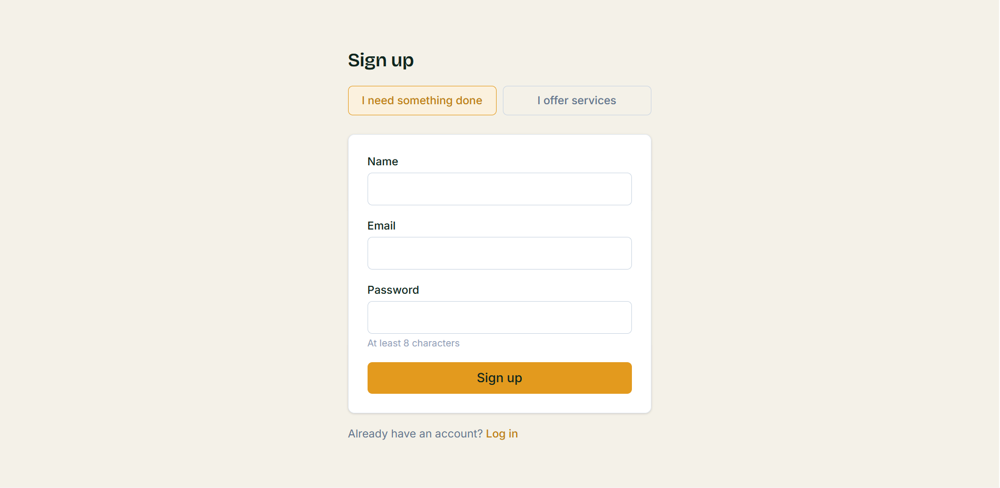
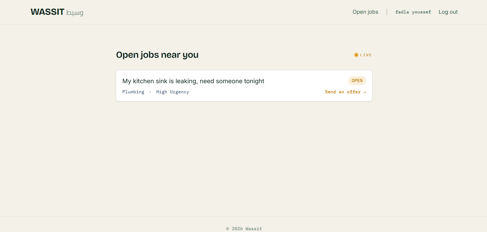
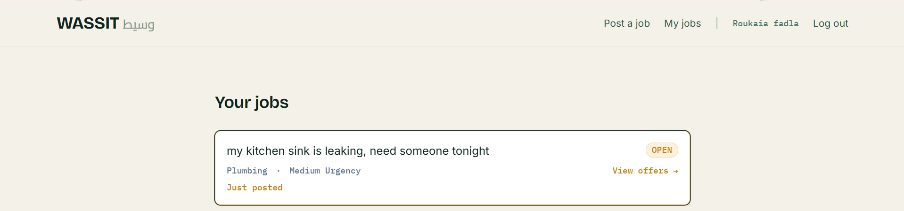

<p align="center">
  
</p>

<h1 align="center">Wassit (وسيط)</h1>

<p align="center">
  Hyperlocal services marketplace — post a job in plain language, nearby
  verified providers respond live, you pick one and get it done.
</p>

---

## What it does

A client describes a job in a sentence or two — no forms, no category
picker required. The description is sent to an AI model that suggests a
category, urgency level, and a fair price range, which the client can
accept or edit before posting. The job is then broadcast in real time to
nearby providers, who can submit offers live; the client picks one and the
job proceeds.

## Architecture



## Features

- **Auth** — JWT-based signup/login with two roles: client and provider
- **AI-assisted job posting** — free-text description → suggested category,
  urgency, and price range, via Google's Gemini API (with a keyword-based
  fallback if the AI call is unavailable, so posting never breaks)
- **Geospatial matching** — jobs are matched to nearby providers based on
  location
- **Real-time job feed** — new jobs are broadcast live to matching
  providers over Socket.io, no page refresh needed
- **Offers** — providers submit offers on open jobs; clients see them
  update live and choose one

## Screenshots











## Not yet built

- In-app chat between client and provider
- Reviews and ratings
- Admin dashboard (verification, disputes)
- Live deployment

## Stack

- **Frontend:** React + Vite + Tailwind
- **Backend:** Node.js, Express, MongoDB Atlas
- **Real-time:** Socket.io
- **Auth:** JWT
- **AI:** Google Gemini API (free tier heheh)

## Local setup

### Backend

```bash
cd backend
npm install
cp .env.example .env   # fill in MONGODB_URI, JWT_SECRET, GEMINI_API_KEY
npm run dev
```

Runs on `http://localhost:5000`.

### Frontend

```bash
cd frontend
npm install
cp .env.example .env
npm run dev
```

Runs on `http://localhost:5173`.

